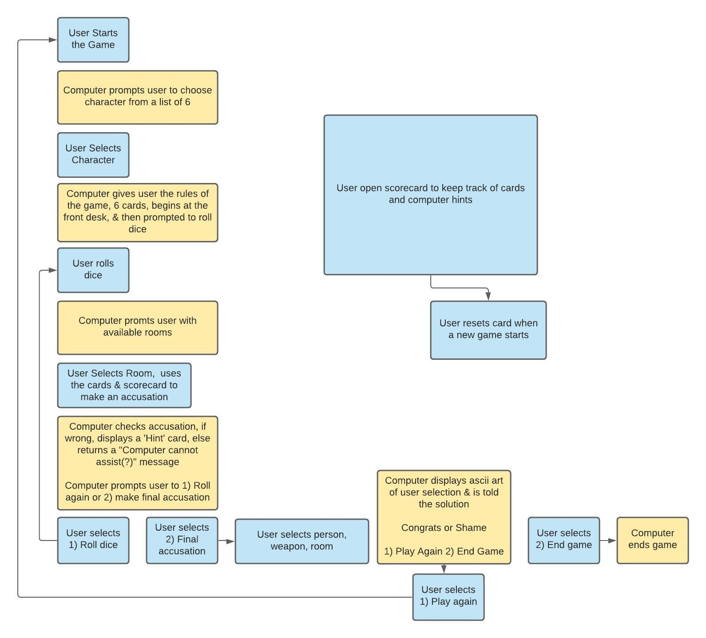

# Software Requirements

What is the vision of this product?
- To solve an imaginary murder of great proportion. 

What pain point does this project solve?
- To help cure the boredom of quarantine with a fun brain bending game. 

Why should we care about your product?
- Our command line Clue game will kill those quarantine woes, incite your blood-lust revenge, tantalize your creativity  ANDDDDD boost your problem-solving skills.  Both sides of the brain for the price of nothing! 

Scope (In/Out)
IN - The CLI game will allow the player to choose different game personalities to play throughout the round. The terminal will display a list of rules to the user for clarification. Users will be able to keep track of clues and hints with the frontend score card. The user can have a fun creative puzzle game, so they can be distracted from being stuck in quarantine

OUT - What won't this app do? It won't bore you to DEATH. It will however MURDER your boredom. 

Minimum Viable Product vs
What will your MVP functionality be? 
User will be able to play a CLI game and predict a killer with hints from the game.

Stretch
What stretch goals are you going to aim for? 
- ascii art
- live players
- ascii animation
- MURDER BOTS

**Functional Requirements** 
List the functionality of your product. This will consist of tasks such as the following:

1. A user will have choice of character to play.
2. A user can make a guess the murderer, weapon, room.
3. A user will be told if their guess is correct or incorrect.
4. A user can use a separate website for their score card. 

**Data Flow**

**Non-Functional Requirements**  
- Usability: We have a front-end to help the user to become a proper detective, we have rules in place to keep the detective on the trail of the investigation at hand. If the detective wants to know about the devilish developers and why they created such a mystery fulfilling murder game. 

- Testability: Making sure our code is written in a format conducive to writing proper tests. No matter how much this bores us to death.

- Coverage Report: To murder the testing requirements to ensure 80% of the code and hiding the unwanted refuse elsewhere (aka bodies).
